# Builder

## Intenção
O padrão Builder separa a construção de um objeto complexo de sua representação, permitindo que o mesmo processo de construção gere diferentes representações. Essa separação torna o código mais modular, flexível e de fácil manutenção, especialmente quando o objeto a ser construído possui muitas etapas ou variações.

## Motivação 
Imagine uma grande construtora que atua em vários segmentos do mercado imobiliário. Em seu portfólio, há projetos padrão, que seguem uma sequência tradicional de construção, e projetos personalizados, onde a ordem de execução das etapas pode ser alterada para atender demandas específicas dos clientes (por exemplo, priorizando a montagem dos ambientes internos antes da fundação completa para projetos com cronogramas diferenciados).

Nesse cenário, o padrão Builder é extremamente útil, pois:

Pois o mesmo Builder pode ser utilizado tanto para projetos padrão quanto para os personalizados.
Facilita a manutenção e a expansão: Ao introduzir novos tipos de construção (novas sequências ou etapas extras), basta criar um novo Diretor que orquestre essas mudanças, sem modificar os Builders existentes.
Permite a reutilização do código: Diferentes diretores podem reutilizar o mesmo Builder para construir produtos similares, mas com variações na ordem de montagem.

```plantuml
@startuml
' Abstract Builder: ConstrutorCasa com métodos atualizados
abstract class ConstrutorCasa {
    # casa : Casa
    + criarNovaCasa()
    + getCasa() : Casa
    + construirFundacao()
    + construirParedes()
    + construirTelhado()
    + construirPortas()
    + construirJanelas()
    + construirGaragem()
    + construirPiscina()
}

' Concrete Builders
class ConstrutorCasaModerna extends ConstrutorCasa
class ConstrutorCasaClassica extends ConstrutorCasa

' Director Padrão: sequência tradicional
class DiretorCasaPadrao {
    - construtor : ConstrutorCasa
    + setConstrutor(construtor : ConstrutorCasa)
    + construirCasa()
    + getCasa() : Casa
}

' Director Personalizado: sequência customizada
class DiretorCasaPersonalizado {
    - construtor : ConstrutorCasa
    + setConstrutor(construtor : ConstrutorCasa)
    + construirCasa()
    + getCasa() : Casa
}

' Produto: Casa com atributos adicionais
class Casa {
    + fundacao : String
    + paredes : String
    + telhado : String
    + numPortas : int
    + numJanelas : int
    + temGaragem : boolean
    + temPiscina : boolean
}

DiretorCasaPadrao --> ConstrutorCasa : "usa"
DiretorCasaPersonalizado --> ConstrutorCasa : "usa"
ConstrutorCasa --> Casa : "cria e monta"
@enduml

````

## Exemplo Builder:
Imagine que você precise construir casas com configurações variadas (modernas, clássicas, minimalistas, etc.). Cada tipo de casa possui detalhes específicos quanto aos materiais, design e estrutura. Utilizar um único método para construir todas essas variações pode resultar em código confuso e de difícil manutenção.

Com o Builder, você consegue:

Separar a lógica de construção da representação final: Cada etapa da montagem fica bem definida e isolada.
Reaproveitar o mesmo processo para criar diferentes produtos: Basta variar a implementação dos passos.
Facilitar a manutenção e extensão: Novos tipos de produtos podem ser adicionados sem alterar o processo central de construção.



## Aplicabilidade

- Use o padrão Builder quando:
    - " o algoritmo para criação de um objeto complexo deve ser independente das partes que compõem o objeto e de como elas são montadas."
    - " o processo de construção deve permitir diferentes representações para o objeto que é construído."

## Estrutura

![alt text](image.png)

## Participantes do Builder: references GOF

- **Builder**
    -  especifica uma interface abstrata para criação de partes de um objetoproduto.
    
- **ConcreteBuilder**
    -  constrói e monta partes do produto pela implementação da interface de Builder;
    -  define e mantém a representação que cria;
    -  Fornece uma interface para recuperação do produto (por exemplo, GetASCIIText, GetTextWidget).
    
- **Director**
    - constrói um objeto usando a interface de Builder.
    
- **Product**.
    -  representa o objeto complexo em construção. ConcreteBuilder constrói a representação interna do produto e define o processo pelo qual ele é montado;
    -  inclui classes que definem as partes constituintes, inclusive as interfaces para a montagem das partes no resultado final.
      

Estrutura da Motivação:

@startuml
' Abstract Builder: ConstrutorCasa com métodos para construir todas as partes
abstract class ConstrutorCasa {
    # casa : Casa
    + criarNovaCasa()
    + getCasa() : Casa
    + construirFundacao()
    + construirParedes()
    + construirTelhado()
    + construirPortas()
    + construirJanelas()
    + construirGaragem()
    + construirPiscina()
}

' Concrete Builders
class ConstrutorCasaModerna extends ConstrutorCasa
class ConstrutorCasaClassica extends ConstrutorCasa

' Director Padrão: utiliza sequência tradicional de construção
class DiretorCasaPadrao {
    - construtor : ConstrutorCasa
    + setConstrutor(construtor : ConstrutorCasa)
    + construirCasa()
    + getCasa() : Casa
}

' Director Personalizado: utiliza sequência customizada de construção
class DiretorCasaPersonalizado {
    - construtor : ConstrutorCasa
    + setConstrutor(construtor : ConstrutorCasa)
    + construirCasa()
    + getCasa() : Casa
}

' Produto: Casa com atributos adicionais
class Casa {
    + fundacao : String
    + paredes : String
    + telhado : String
    + numPortas : int
    + numJanelas : int
    + temGaragem : boolean
    + temPiscina : boolean
}

DiretorCasaPadrao --> ConstrutorCasa : "usa"
DiretorCasaPersonalizado --> ConstrutorCasa : "usa"
ConstrutorCasa --> Casa : "cria e monta"

@enduml


## Participantes da motivação:

- **Builder (ConstrutorCasa)**  
  - Especifica uma interface abstrata para projetar e montar as partes de uma casa (ou produto).  
  - **Exemplo**: Planeja os cômodos, o telhado, as portas e outros detalhes estruturais.

- **ConcreteBuilder (ConstrutorCasaModerna, ConstrutorCasaClassica)**
  - Implementa a interface do Builder para criar partes específicas da casa.  
  - Define e mantém os detalhes e o design específico da casa sendo construída.  
  - Fornece o método para recuperar a casa pronta.
  - **Exemplo**: Um arquiteto especializado em casas modernas cria designs com janelas amplas e linhas retas, enquanto o de casas clássicas prioriza ornamentos e telhados inclinados.

- **Director (DiretorCasaPadrao, DiretorCasaPersonalizado)**
  - Coordena o processo de construção seguindo um plano pré-definido.  
  - Não se preocupa com os detalhes de cada tipo de casa, apenas segue o plano do arquiteto escolhido.  
  - **Exemplo**: O diretor supervisiona os trabalhadores para garantir que as casas modernas ou clássicas sejam construídas corretamente.

- **Product (Casa)**  
  - Representa o objeto final criado.  
  - É o resultado do trabalho coordenado pelo Director e definido pelo ConcreteBuilder.  
  - **Exemplo**: A casa moderna com janelas amplas e linhas retas, ou a casa clássica com ornamentos e telhado inclinado.
 
## Exemplo sem Builder: 
Neste exemplo, a criação da Casa é feita diretamente por uma classe responsável por montar os objetos conforme as configurações desejadas. Embora seja simples, essa abordagem pode levar a duplicação de código e dificuldade na manutenção conforme as variações aumentam.

@startuml
class Casa {
  - fundacao : String
  - paredes : String
  - telhado : String
  - numPortas : int
  - numJanelas : int
  - temGaragem : boolean
  - temPiscina : boolean
  + setFundacao(fundacao : String)
  + setParedes(paredes : String)
  + setTelhado(telhado : String)
  + setNumPortas(numPortas : int)
  + setNumJanelas(numJanelas : int)
  + setTemGaragem(temGaragem : boolean)
  + setTemPiscina(temPiscina : boolean)
  + toString() : String
}

class CasaCreator {
  + createCasaModerna() : Casa
  + createCasaClassica() : Casa
  + createCasaLuxo() : Casa
}

CasaCreator --> Casa : cria
@enduml


```java
package SemBuilder;

public class Casa {
    private String fundacao;
    private String paredes;
    private String telhado;
    private int numPortas;
    private int numJanelas;
    private boolean temGaragem;
    private boolean temPiscina;

    // Getters e setters
    public void setFundacao(String fundacao) {
        this.fundacao = fundacao;
    }
    
    public void setParedes(String paredes) {
        this.paredes = paredes;
    }
    
    public void setTelhado(String telhado) {
        this.telhado = telhado;
    }
    
    public void setNumPortas(int numPortas) {
        this.numPortas = numPortas;
    }
    
    public void setNumJanelas(int numJanelas) {
        this.numJanelas = numJanelas;
    }
    
    public void setTemGaragem(boolean temGaragem) {
        this.temGaragem = temGaragem;
    }
    
    public void setTemPiscina(boolean temPiscina) {
        this.temPiscina = temPiscina;
    }
    
    @Override
    public String toString() {
        return "Casa [fundacao=" + fundacao + ", paredes=" + paredes 
                + ", telhado=" + telhado + ", numPortas=" + numPortas 
                + ", numJanelas=" + numJanelas + ", temGaragem=" + temGaragem 
                + ", temPiscina=" + temPiscina + "]";
    }
}
package SemBuilder;

public class CasaCreator {

    public Casa createCasaModerna() {
        Casa casa = new Casa();
        casa.setFundacao("Concreto armado com isolamento térmico");
        casa.setParedes("Vidro e aço");
        casa.setTelhado("Telhado plano com painéis solares");
        casa.setNumPortas(4);
        casa.setNumJanelas(10);
        casa.setTemGaragem(true);
        casa.setTemPiscina(false);
        return casa;
    }
    
    public Casa createCasaClassica() {
        Casa casa = new Casa();
        casa.setFundacao("Concreto tradicional");
        casa.setParedes("Alvenaria com revestimento em pedra");
        casa.setTelhado("Telhado inclinado com telhas cerâmicas");
        casa.setNumPortas(6);
        casa.setNumJanelas(8);
        casa.setTemGaragem(true);
        casa.setTemPiscina(false);
        return casa;
    }
}
package SemBuilder;

public class SemBuilderExample {
    public static void main(String[] args) {
        CasaCreator creator = new CasaCreator();
        
        Casa casaModerna = creator.createCasaModerna();
        System.out.println("Casa Moderna: " + casaModerna);
        
        Casa casaClassica = creator.createCasaClassica();
        System.out.println("Casa Clássica: " + casaClassica);
    }
}

```




## Exemplo com Builder: 

@startuml
class Casa {
  - fundacao : String
  - paredes : String
  - telhado : String
  - numPortas : int
  - numJanelas : int
  - temGaragem : boolean
  - temPiscina : boolean
  + setFundacao(String)
  + setParedes(String)
  + setTelhado(String)
  + setNumPortas(int)
  + setNumJanelas(int)
  + setTemGaragem(boolean)
  + setTemPiscina(boolean)
  + toString() : String
}

abstract class ConstrutorCasa {
  # casa : Casa
  + criarNovaCasa()
  + getCasa() : Casa
  + construirFundacao()
  + construirParedes()
  + construirTelhado()
  + construirPortas()
  + construirJanelas()
  + construirGaragem()
  + construirPiscina()
}

class ConstrutorCasaModerna extends ConstrutorCasa
class ConstrutorCasaClassica extends ConstrutorCasa

class Diretor {
  - construtor : ConstrutorCasa
  + setConstrutor(construtor : ConstrutorCasa)
  + construirCasa()
  + getCasa() : Casa
}

Diretor --> ConstrutorCasa : usa
ConstrutorCasa --> Casa : cria

note right of ConstrutorCasa
  Construtor concreto
  define como a casa é construída
end note
@enduml


## Colaborações: 

- O ConstrutorCasa depende de um ConstrutorModelo específico para executar os passos necessários à construção de uma casa. Ele coordena o processo, chamando os métodos do construtor em uma sequência definida, sem se preocupar com os detalhes da implementação de cada passo.
- O construtor é responsável por construir as partes individuais da casa (fundação, paredes, telhado) e entregar o resultado final. Cada implementação do construtor conhece os detalhes específicos de um estilo de casa.
- O Diretor obtém a casa finalizada do arquiteto e a entrega ao cliente ou a utiliza em outra parte do sistema.
- O cliente especifica ao Diretor qual tipo de casa deseja construir. O ConstrutorCasa então escolhe o ConstrutorModelo apropriado para realizar o trabalho

## Consequências:

1. Separação entre o processo de construção e a representação final:
- O padrão isola a lógica de criação da estrutura de um objeto, permitindo modificar a maneira como os objetos são construídos sem alterar sua lógica interna.
- A lógica para construir o objeto é centralizada no Director, enquanto os detalhes específicos ficam nos Builders. Isso facilita a criação de diferentes representações (casas modernas, clássicas, etc.) sem duplicar código.
Manutenção facilitada:

2. Novos tipos de representações podem ser adicionados criando novos Builders, sem modificar o código do Director, promovendo o princípio Open/Closed.
Facilidade na construção de objetos complexos:
- O padrão organiza a construção de objetos que possuem muitos passos e dependências, mantendo o código mais limpo e legível.
- Permite que o Director controle a sequência e os detalhes da construção sem se preocupar com os atributos específicos de cada tipo de objeto.
- A implementação do padrão adiciona várias classes (como Builder, ConcreteBuilders e Director), o que pode ser considerado um overhead desnecessário em sistemas simples.
- Para sistemas pequenos ou com objetos simples, o uso do padrão pode parecer excessivo, já que criar uma classe para cada variação de objeto pode ser desnecessário

## Implementação:

O Cliente escolhe o tipo de objeto que deseja construir e passa essa decisão para o Director.
O Director recebe um Builder (por exemplo, ConstrutorCasaModerna) e chama os métodos do Builder em uma sequência pré-definida.
O ConcreteBuilder executa os métodos e configura as partes do objeto (Casa), armazenando o estado internamente.
Após completar o processo, o ConcreteBuilder retorna o objeto final para o Cliente.


### Exemplo:

```java
// Produto: Casa
public class Casa {
    private String fundacao;
    private String paredes;
    private String telhado;
    private int numPortas;
    private int numJanelas;
    private boolean temGaragem;
    private boolean temPiscina;

    // Getters e setters
    public void setFundacao(String fundacao) {
        this.fundacao = fundacao;
    }
    public void setParedes(String paredes) {
        this.paredes = paredes;
    }
    public void setTelhado(String telhado) {
        this.telhado = telhado;
    }
    public void setNumPortas(int numPortas) {
        this.numPortas = numPortas;
    }
    public void setNumJanelas(int numJanelas) {
        this.numJanelas = numJanelas;
    }
    public void setTemGaragem(boolean temGaragem) {
        this.temGaragem = temGaragem;
    }
    public void setTemPiscina(boolean temPiscina) {
        this.temPiscina = temPiscina;
    }
    
    @Override
    public String toString() {
        return "Casa [fundacao=" + fundacao + ", paredes=" + paredes 
                + ", telhado=" + telhado + ", numPortas=" + numPortas 
                + ", numJanelas=" + numJanelas + ", temGaragem=" + temGaragem 
                + ", temPiscina=" + temPiscina + "]";
    }
}

// Builder: Classe Abstrata
public abstract class ConstrutorCasa {
    protected Casa casa;
    
    public void criarNovaCasa() {
        casa = new Casa();
    }
    
    public Casa getCasa() {
        return casa;
    }
    
    public abstract void construirFundacao();
    public abstract void construirParedes();
    public abstract void construirTelhado();
    public abstract void construirPortas();
    public abstract void construirJanelas();
    public abstract void construirGaragem();
    public abstract void construirPiscina();
}


// ConcreteBuilder: ConstrutorCasaClassica
public class ConstrutorCasaModerna extends ConstrutorCasa {
    @Override
    public void construirFundacao() {
        casa.setFundacao("Concreto armado com isolamento térmico");
    }
    
    @Override
    public void construirParedes() {
        casa.setParedes("Vidro e aço");
    }
    
    @Override
    public void construirTelhado() {
        casa.setTelhado("Telhado plano com painéis solares");
    }
    
    @Override
    public void construirPortas() {
        casa.setNumPortas(4);
    }
    
    @Override
    public void construirJanelas() {
        casa.setNumJanelas(10);
    }
    
    @Override
    public void construirGaragem() {
        casa.setTemGaragem(true);
    }
    
    @Override
    public void construirPiscina() {
        casa.setTemPiscina(false);
    }
}


// Director: Gerencia o Processo de Construção

public class DiretorCasaPadrao {
    private ConstrutorCasa construtor;
    
    public void setConstrutor(ConstrutorCasa construtor) {
        this.construtor = construtor;
    }
    
    public void construirCasa() {
        construtor.criarNovaCasa();
        construtor.construirFundacao();
        construtor.construirParedes();
        construtor.construirTelhado();
    }
    
    public Casa getCasa() {
        return construtor.getCasa();
    }
}

public class DiretorCasaPersonalizado {
    private ConstrutorCasa construtor;
    
    public void setConstrutor(ConstrutorCasa construtor) {
        this.construtor = construtor;
    }
    
    public void construirCasa() {
        construtor.criarNovaCasa();
        construtor.construirGaragem();
        construtor.construirJanelas();
        construtor.construirFundacao();
        construtor.construirParedes();
        construtor.construirTelhado();
        construtor.construirPortas();
        construtor.construirPiscina();
    }
    
    public Casa getCasa() {
        return construtor.getCasa();
    }
}


// Client: Exemplo de Uso Com Builder
public class BuilderMultipleDirectorsExample {
    public static void main(String[] args) {
        DiretorCasaPadrao diretorPadrao = new DiretorCasaPadrao();
        ConstrutorCasa construtorModerna = new ConstrutorCasaModerna();
        diretorPadrao.setConstrutor(construtorModerna);
        diretorPadrao.construirCasa();
        Casa casaModernaPadrao = diretorPadrao.getCasa();
        System.out.println("Casa Moderna (Diretor Padrão): " + casaModernaPadrao);
        
        DiretorCasaPersonalizado diretorPersonalizado = new DiretorCasaPersonalizado();
        ConstrutorCasa construtorModerna2 = new ConstrutorCasaModerna();
        diretorPersonalizado.setConstrutor(construtorModerna2);
        diretorPersonalizado.construirCasa();
        Casa casaModernaPersonalizada = diretorPersonalizado.getCasa();
        System.out.println("Casa Moderna (Diretor Personalizado): " + casaModernaPersonalizada);
        
        DiretorCasaPadrao diretorPadraoClassica = new DiretorCasaPadrao();
        ConstrutorCasa construtorClassica = new ConstrutorCasaClassica();
        diretorPadraoClassica.setConstrutor(construtorClassica);
        diretorPadraoClassica.construirCasa();
        Casa casaClassicaPadrao = diretorPadraoClassica.getCasa();
        System.out.println("Casa Clássica (Diretor Padrão): " + casaClassicaPadrao);
        
        DiretorCasaPersonalizado diretorPersonalizadoClassica = new DiretorCasaPersonalizado();
        ConstrutorCasa construtorClassica2 = new ConstrutorCasaClassica();
        diretorPersonalizadoClassica.setConstrutor(construtorClassica2);
        diretorPersonalizadoClassica.construirCasa();
        Casa casaClassicaPersonalizada = diretorPersonalizadoClassica.getCasa();
        System.out.println("Casa Clássica (Diretor Personalizado): " + casaClassicaPersonalizada);
    }
}

```

## Conclusão
Ao comparar os dois exemplos, nota-se que:

Sem Builder:
A criação do objeto é feita de forma direta, mas a abordagem pode resultar em acoplamento forte, duplicação de código e dificuldades para estender o sistema conforme novas variações surgem.

Com Builder:
A construção é modularizada em etapas, permitindo maior flexibilidade, separação de responsabilidades e facilidade na manutenção e extensão do código.

O padrão Builder se mostra vantajoso em cenários onde objetos complexos precisam ser criados de forma flexível e reutilizável, especialmente quando há diversas variações do produto final.


```

## Usos conhecidos:

O padrão **Builder** é amplamente utilizado em várias situações onde objetos complexos precisam ser criados de maneira flexível e reutilizável.

###  Interface de Criação de GUI (Interfaces Gráficas de Usuário)

**Exemplo**: **Frameworks de interface de usuário como Swing ou JavaFX**
- Em frameworks de interface gráfica, onde você pode criar painéis, botões e menus com várias opções, como texto, ícones, eventos, cores, etc.
- O padrão Builder ajuda a criar componentes complexos de interface sem a necessidade de construir cada elemento manualmente.

**Aplicação**: Frameworks de interface de usuário em Java ou C#, onde você deseja permitir a criação de uma interface flexível e modular.

---
```

### Construção de Consultas Complexas (Query Builders)

**Exemplo**: Consulta a bancos de dados SQL
- Quando você precisa construir consultas SQL complexas com diversas condições, joins, agrupamentos, etc., o Builder pode ser usado para criar essas consultas de forma legível e modular.
- Isso permite que você adicione facilmente novas cláusulas ou condições sem quebrar o código.

```java

// Classe que representa a consulta SQL construída
public class SQLQuery {
    private String select;
    private String from;
    private String where;
    private String orderBy;

    public SQLQuery(String select, String from, String where, String orderBy) {
        this.select = select;
        this.from = from;
        this.where = where;
        this.orderBy = orderBy;
    }

    @Override
    public String toString() {
        StringBuilder query = new StringBuilder();
        query.append("SELECT ").append(select)
             .append(" FROM ").append(from);
        if (where != null && !where.isEmpty()) {
            query.append(" WHERE ").append(where);
        }
        if (orderBy != null && !orderBy.isEmpty()) {
            query.append(" ORDER BY ").append(orderBy);
        }
        return query.toString();
    }
}

// Builder para construir a consulta SQL
public class SQLQueryBuilder {
    private String select;
    private String from;
    private String where;
    private String orderBy;

    public SQLQueryBuilder select(String select) {
        this.select = select;
        return this;
    }

    public SQLQueryBuilder from(String from) {
        this.from = from;
        return this;
    }

    public SQLQueryBuilder where(String where) {
        this.where = where;
        return this;
    }

    public SQLQueryBuilder orderBy(String orderBy) {
        this.orderBy = orderBy;
        return this;
    }

    public SQLQuery build() {
        return new SQLQuery(select, from, where, orderBy);
    }
}

// Classe de exemplo para utilizar o Query Builder
public class QueryBuilderExample {
    public static void main(String[] args) {
        SQLQuery query = new SQLQueryBuilder()
                            .select("*")
                            .from("usuarios")
                            .where("idade > 18")
                            .orderBy("nome")
                            .build();
        System.out.println(query);
    }
}

```

**Aplicação**: Bibliotecas como **Hibernate Criteria API** ou **JPA Criteria API**, que permitem construir consultas dinâmicas e flexíveis sem concatenar strings SQL manualmente.

---

### . Criação de Objetos de Documentos (Exemplo: PDF ou HTML)

**Exemplo**: **Geradores de Documentos**
- Geradores de documentos (PDF, Word, HTML) onde cada documento pode ter diferentes seções, tabelas, listas, parágrafos, imagens, etc.
- O Builder permite que você construa esses documentos de forma modular e eficiente, sem ter que lidar com a complexidade de cada componente individual.


```java 

import java.util.ArrayList;
import java.util.List;

// Representa um elemento HTML
public class HtmlElement {
    private String tagName;
    private String textContent;
    private List<HtmlElement> children;

    public HtmlElement(String tagName, String textContent) {
        this.tagName = tagName;
        this.textContent = textContent;
        this.children = new ArrayList<>();
    }

    public void addChild(HtmlElement child) {
        children.add(child);
    }

    public String toHtml() {
        StringBuilder sb = new StringBuilder();
        sb.append("<").append(tagName).append(">");
        if (textContent != null) {
            sb.append(textContent);
        }
        for (HtmlElement child : children) {
            sb.append(child.toHtml());
        }
        sb.append("</").append(tagName).append(">");
        return sb.toString();
    }
}

// Builder para criar um documento HTML
public class HtmlBuilder {
    private HtmlElement root;

    public HtmlBuilder(String rootTagName) {
        root = new HtmlElement(rootTagName, null);
    }

    public HtmlBuilder addChild(String tagName, String textContent) {
        root.addChild(new HtmlElement(tagName, textContent));
        return this;
    }

    public String build() {
        return root.toHtml();
    }
}

// Classe de exemplo para utilizar o HTML Builder
public class HtmlBuilderExample {
    public static void main(String[] args) {
        HtmlBuilder builder = new HtmlBuilder("html");
        builder.addChild("head", "")
               .addChild("body", "Olá, mundo!");
        String html = builder.build();
        System.out.println(html);
    }
}
```


**Aplicação**: Geradores de relatórios PDF em bibliotecas como **Apache PDFBox** ou **iText**, onde os documentos podem ser construídos passo a passo (tabelas, textos, imagens, etc.) utilizando um único objeto `Builder`.

---

###  Criando APIs Fluentes

- Muitas vezes, o padrão Builder é usado para criar **APIs fluentes**, onde você pode encadear chamadas de método de forma legível e fácil de usar, configurando um objeto de forma incremental.
- O padrão é ideal para cenários onde você tem muitas opções de configuração e deseja permitir um fluxo contínuo de chamadas de métodos.

**Aplicação**: Configuração de APIs em bibliotecas Java ou frameworks como **Spring**, onde você pode configurar beans ou objetos de forma incremental, por exemplo, ao definir uma configuração de serviço, a configuração de banco de dados, ou a configuração de segurança.

---

### Construção de Objetos Imutáveis

- Em muitas linguagens de programação, o padrão Builder é utilizado para construir objetos imutáveis, onde os objetos não podem ser alterados após sua criação. 
- O Builder é usado para preencher os valores do objeto durante a construção, e uma vez que o objeto está pronto, ele não pode ser modificado.

**Aplicação**: Uso do Builder em bibliotecas como **Guava** ou **Java**, quando se deseja criar objetos imutáveis com um número variável de parâmetros.

--- 
### Compilação de Modelos de Arquitetura
Arquiteturas de software complexas
O padrão Builder é útil na criação de componentes de software que exigem configuração detalhada, como componentes de sistemas distribuídos ou microserviços, onde cada serviço pode ter diferentes opções de configuração e implementação.
Arquitetura de sistemas distribuídos em que você precisa construir a estrutura de um sistema com múltiplos nós e serviços, cada um com suas próprias configurações e opções.


